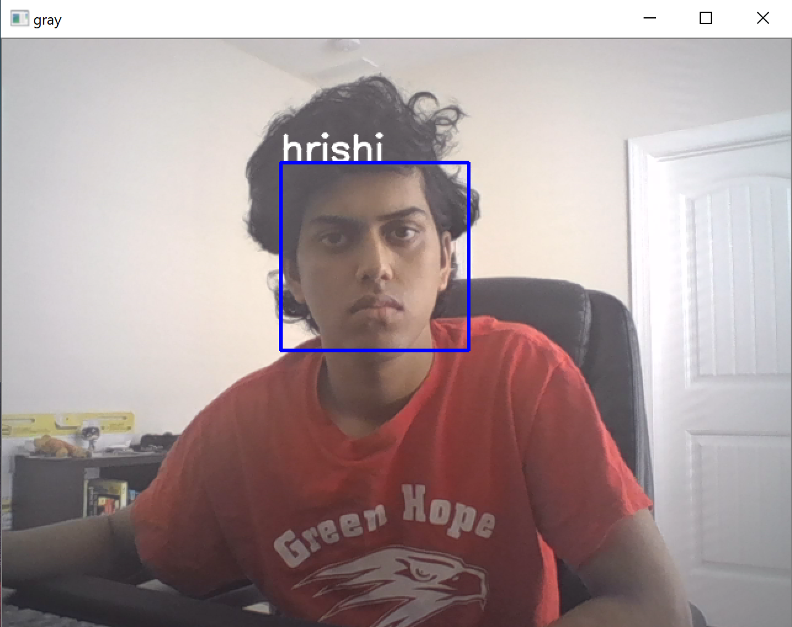

# Face_Detection

This Python program uses OpenAI's Haarcascades to detect faces and used OpenAI's LBPH Face Recognizer to train a model to recognize faces. 

The original data set is not included in this repository. 
